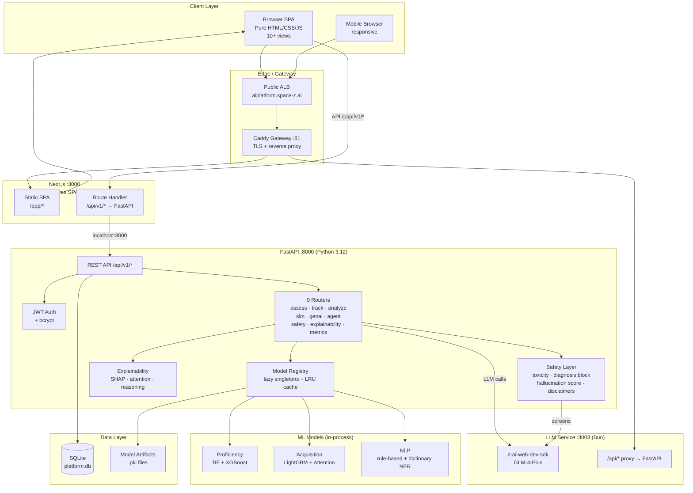
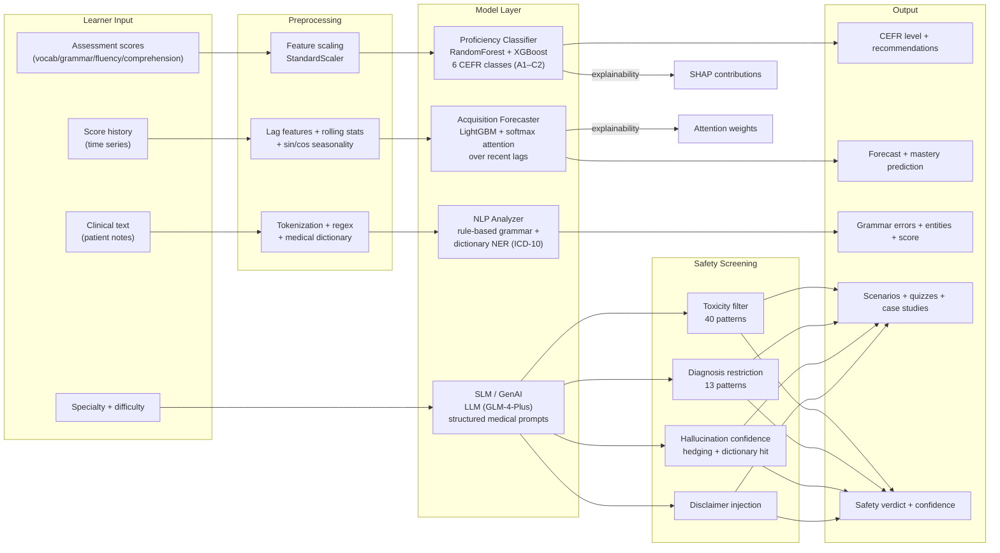
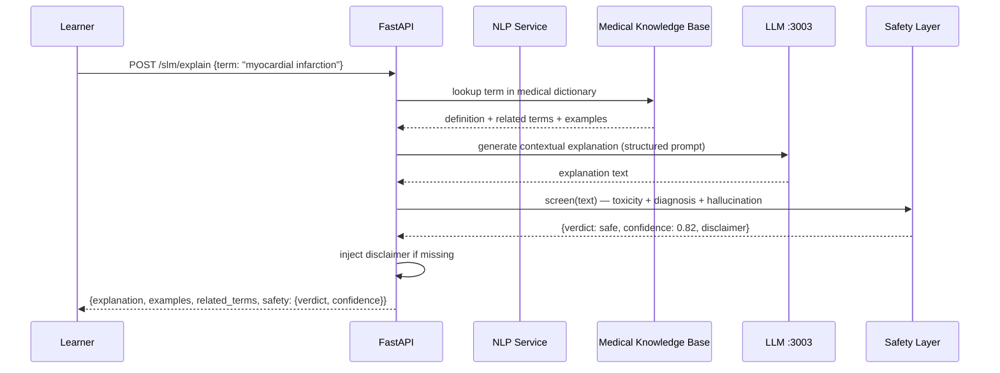
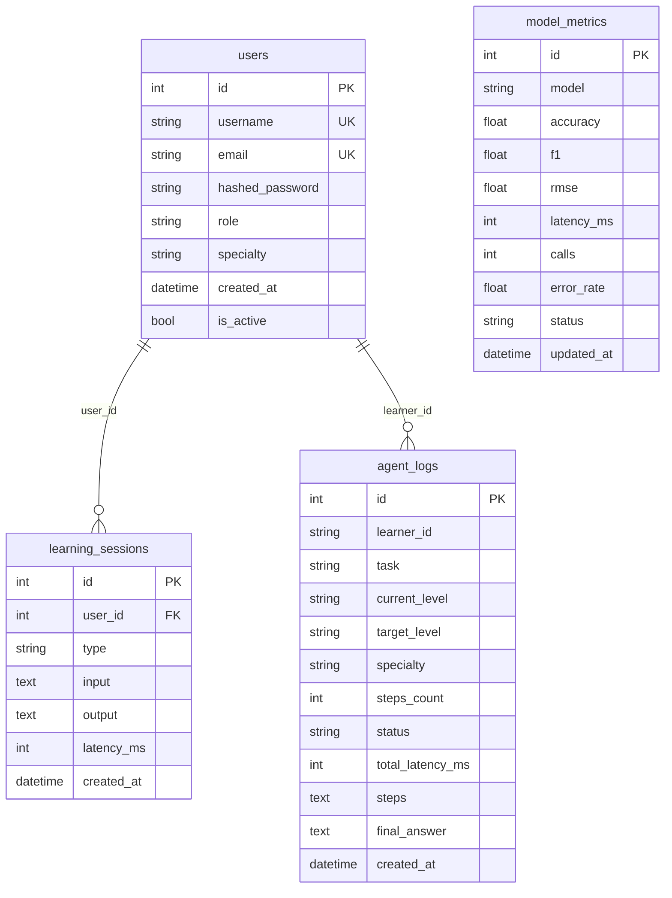
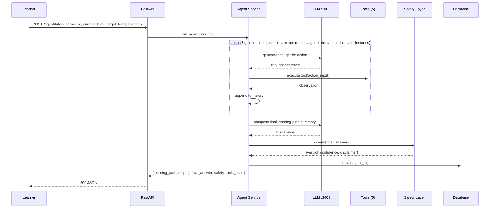
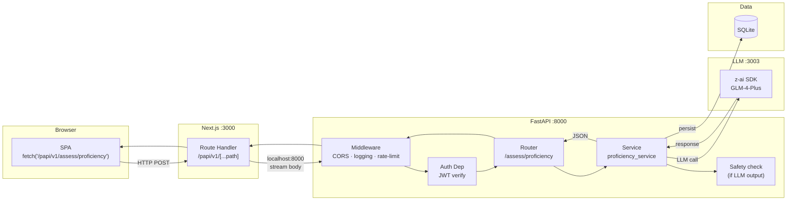
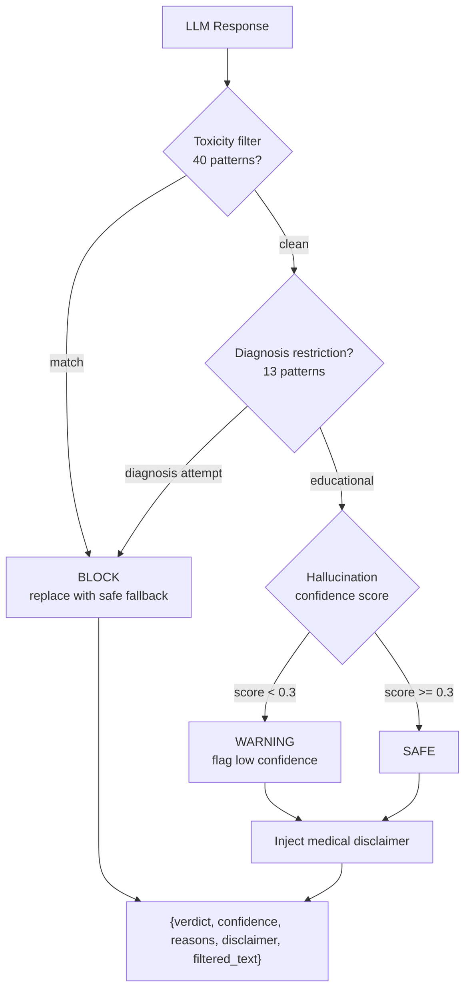
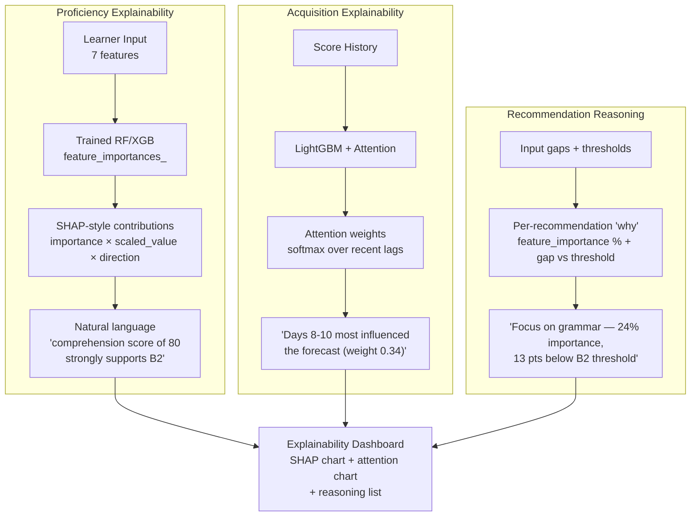
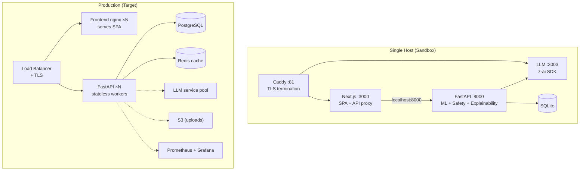
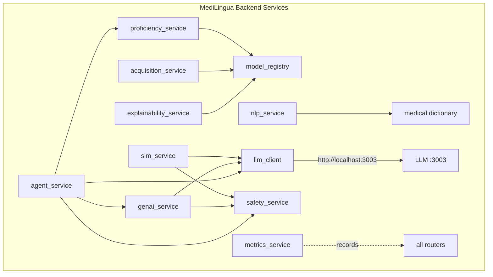

# Architecture Diagram Pack — MediLingua

**Personalized Language Learning for Medical Professionals** — Production AI System Architecture.

All diagrams are Mermaid — render in GitHub, VS Code, or [mermaid.live](https://mermaid.live).

---

## 1. System Architecture (C4 Level 2 — Container)

---

## 2. AI/ML Pipeline

---

## 3. RAG / Retrieval Flow (Medical Knowledge)

---

## 4. Database Schema (ER Diagram)

---

## 5. Agentic AI Workflow (ReAct Tutor)

---

## 6. API Gateway / Request Flow

---

## 7. AI Safety Pipeline (Medical-Grade Guardrails)

---

## 8. Explainability Architecture (Trust Layer)

---

## 9. Deployment Topology

---

## 10. Component Interaction (C4 Level 3)

