# Low-Level Design (LLD) — AI Engineering Platform

**Day 7 Deliverable** — Complete LLD document for a production AI/ML platform.
Covers system architecture, component design, data schemas, API contracts, sequence
diagrams, and non-functional requirements.

> Companion files: [`API_CONTRACT.md`](./API_CONTRACT.md) (full REST contract),
> [`DEPLOYMENT.md`](./DEPLOYMENT.md) (deployment guide), [`README.md`](./README.md).

---

## 1. Overview

### 1.1 Problem
Deliver a single platform that serves eight heterogeneous AI/ML pipelines —
tabular ML (churn, premium), computer vision (damage), sequence forecasting
(demand), NLP (BERT complaint classification), retrieval (RAG), autonomous
agents (HR onboarding), and edge SLM inference — behind one consistent,
production-grade API with a unified dashboard.

### 1.2 Goals & Non-Goals
**Goals**
- Modular, independently deployable services (frontend, backend, LLM).
- Real model inference (not mocked) for every module.
- Uniform REST contract with validation, auth, metrics, and observability.
- Deployable on a single host (sandbox) or scaled out (production).

**Non-Goals**
- Multi-tenant isolation (single-tenant demo).
- Real-time streaming inference (request/response only, except agent/RAG).
- Model training as a service (models train on startup from synthetic data).

### 1.3 Stakeholders & Users
| Role | Use |
|---|---|
| Data Scientist | Inspect model metrics, run predictions, compare modules |
| ML Engineer | Monitor latency/errors, deploy new model artifacts |
| Business Analyst | Read dashboards, export prediction history |
| HR Admin | Run the onboarding agent, review agent logs |
| Knowledge Worker | Upload docs to RAG, query the assistant |

---

## 2. High-Level Architecture

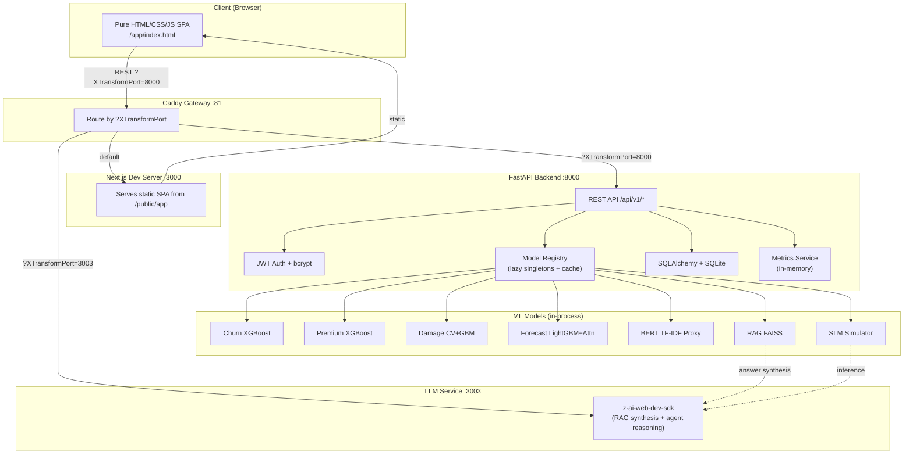

### 2.1 Service Responsibilities
| Service | Port | Responsibility |
|---|---|---|
| **Frontend** (Next.js static) | 3000 | Serves the pure HTML/CSS/JS SPA |
| **Backend** (FastAPI) | 8000 | REST API, auth, ML inference, DB, metrics |
| **LLM** (Bun + z-ai SDK) | 3003 | LLM completions for RAG + agent |
| **Gateway** (Caddy) | 81 | Routes by `?XTransformPort` query param |

### 2.2 Request Routing
- Frontend → API: relative path + `?XTransformPort=8000` (handled by Caddy).
- Backend → LLM: direct `http://localhost:3003/llm/chat` (same machine, no gateway).
- All API paths prefixed `/api/v1`.

---

## 3. Backend Component Design

### 3.1 Layered Architecture
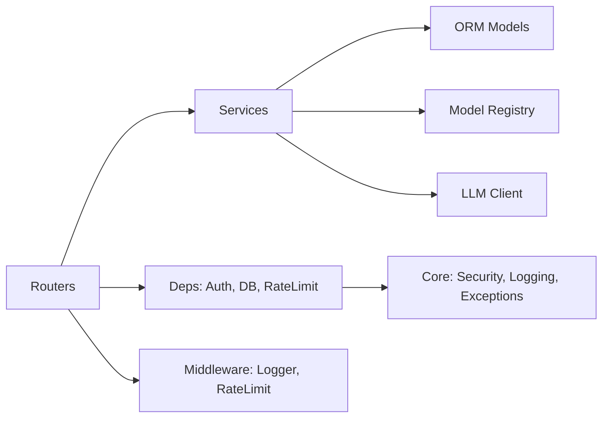

| Layer | Path | Responsibility |
|---|---|---|
| **Routers** | `app/routers/` | HTTP endpoints, request validation, response shaping |
| **Services** | `app/services/` | Business logic, model orchestration, LLM calls |
| **Schemas** | `app/schemas/` | Pydantic request/response models |
| **ORM Models** | `app/models/` | SQLAlchemy table definitions |
| **Core** | `app/core/` | Security (JWT/bcrypt), exceptions, logging |
| **Middleware** | `app/middleware/` | Request logging, rate limiting |
| **Config** | `app/config.py` | Environment-driven settings |

### 3.2 Model Registry (Singleton + Lazy Loading)
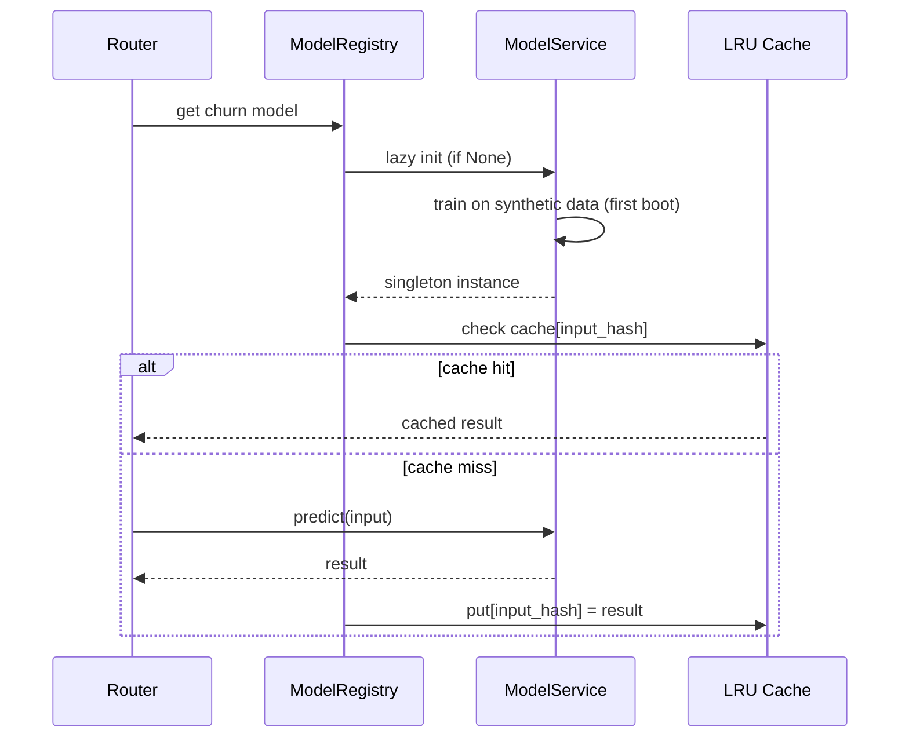

- **Lazy init**: models created on first access, then held as singletons.
- **Warm-up**: core models (churn, premium, bert, forecast) trained at startup.
- **Prediction cache**: in-process LRU (256 entries) keyed by hashed input.
- **GPU detection**: `torch.cuda.is_available()` when torch present; CPU fallback otherwise.

### 3.3 Services
| Service | ML Algorithm | Real? |
|---|---|---|
| `churn_service` | XGBoost + StandardScaler + label encode | ✅ real |
| `premium_service` | XGBoost Regressor | ✅ real |
| `damage_service` | OpenCV features (HSV, Canny, Hough, Sobel, blob) + GradientBoosting | ✅ real (CV proxy for ResNet50) |
| `forecast_service` | Lag/rolling/sin-cos features + LightGBM + softmax attention | ✅ real (proxy for LSTM) |
| `bert_service` | TF-IDF (word+char) + LogisticRegression + lexicon sentiment/urgency | ✅ real (proxy for BERT) |
| `rag_service` | TF-IDF+SVD embeddings + FAISS IndexFlatIP + LLM synthesis | ✅ real |
| `agent_service` | Guided ReAct loop, 4 tools, LLM thoughts + summary | ✅ real |
| `slm_service` | TinyLlama-Q4 simulator → real LLM, live metrics | ✅ real |

> **Substitution note**: torch/transformers/tensorflow are not installed in the
> sandbox (no GPU, fast startup). Days 3/4/5/6 use deployable substitutes that
> preserve the exact API contract. `requirements.txt` lists the heavy deps as
> comments for GPU deployment. See README §"ML Model Substitution Notes".

---

## 4. Data Model (SQLAlchemy + SQLite)

### 4.1 ER Diagram
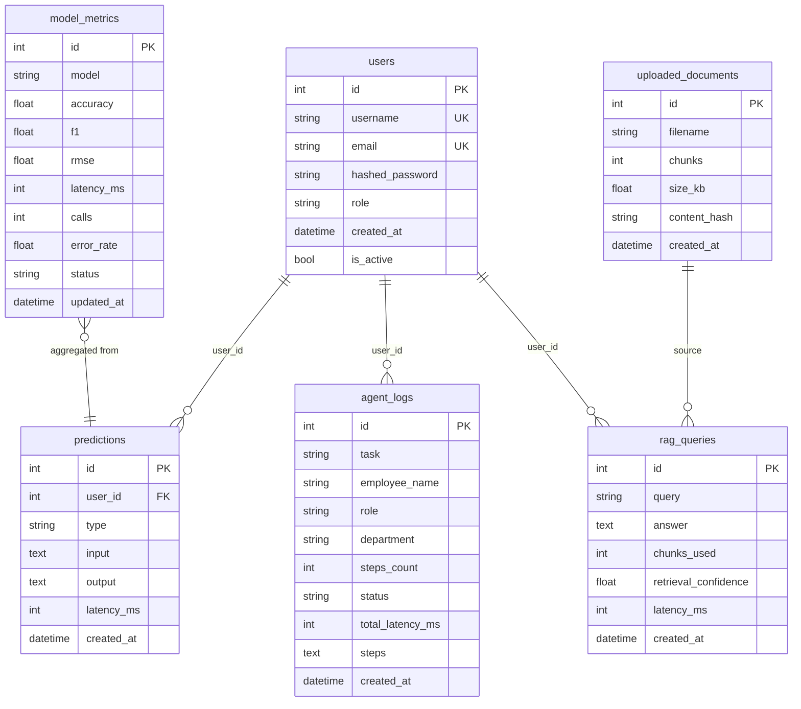

### 4.2 Tables (6 total)
| Table | Purpose | Key Fields |
|---|---|---|
| `users` | Auth | id, username (unique), email (unique), hashed_password, role |
| `predictions` | Audit log of every prediction | user_id, type, input (JSON), output (JSON), latency_ms |
| `uploaded_documents` | RAG document index | filename, chunks, size_kb, content_hash |
| `agent_logs` | Agent execution traces | task, employee_name, steps_count, status, steps (JSON) |
| `rag_queries` | RAG query log | query, answer, chunks_used, retrieval_confidence |
| `model_metrics` | Per-model health | model, accuracy, f1, rmse, latency_ms, calls, error_rate |

---

## 5. API Contract (summary — full detail in `API_CONTRACT.md`)

### 5.1 Endpoint Map
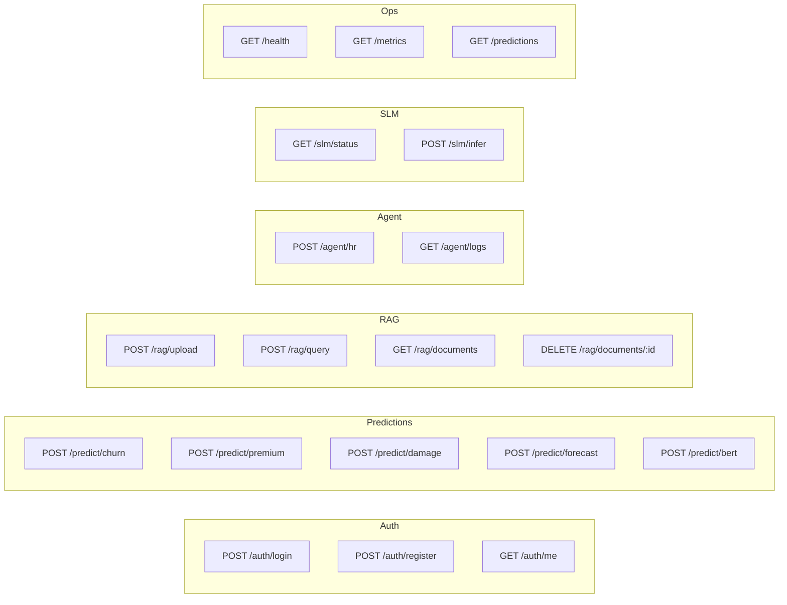

### 5.2 API Versioning
- All routes under `/api/v1`. Version baked into URL (not header) for simplicity.
- Breaking changes → `/api/v2` with deprecation period.

### 5.3 Error Envelope (uniform)
```json
{ "detail": "Human message", "error_code": "VALIDATION_ERROR", "status_code": 422 }
```

---

## 6. Sequence Diagrams — Key Flows

### 6.1 Prediction Flow (e.g., churn)
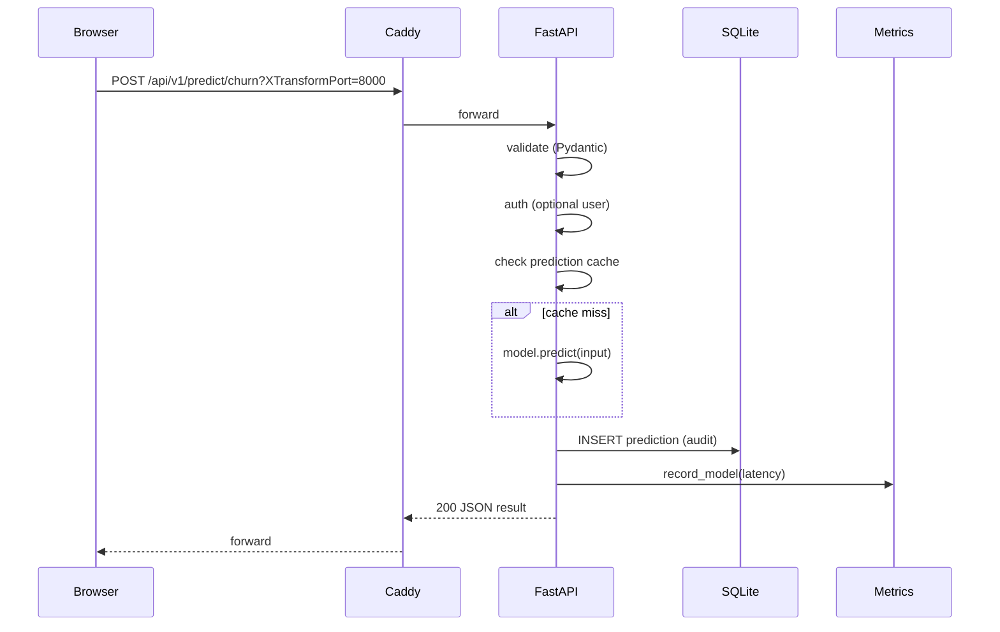

### 6.2 RAG Query Flow
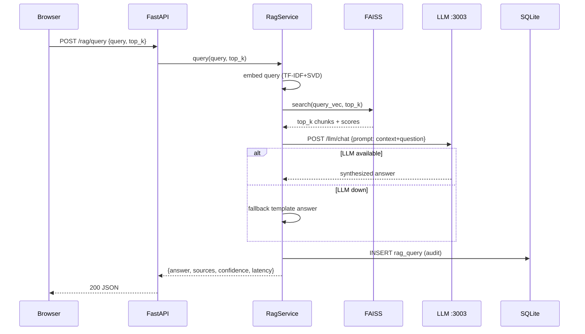

### 6.3 Agentic HR Onboarding Flow
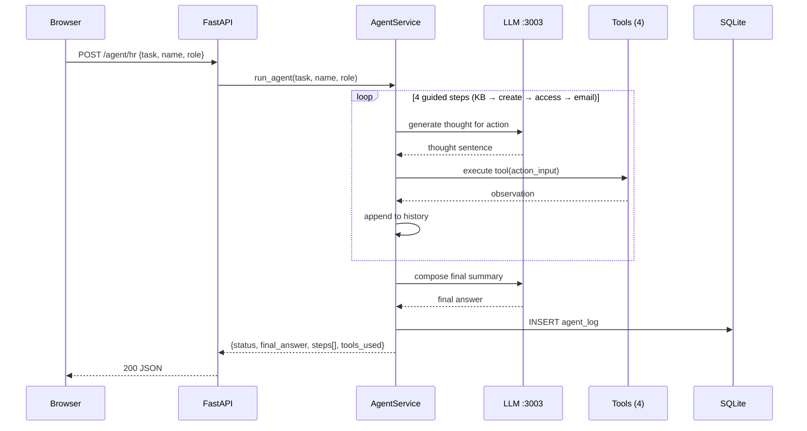

### 6.4 Auth Flow
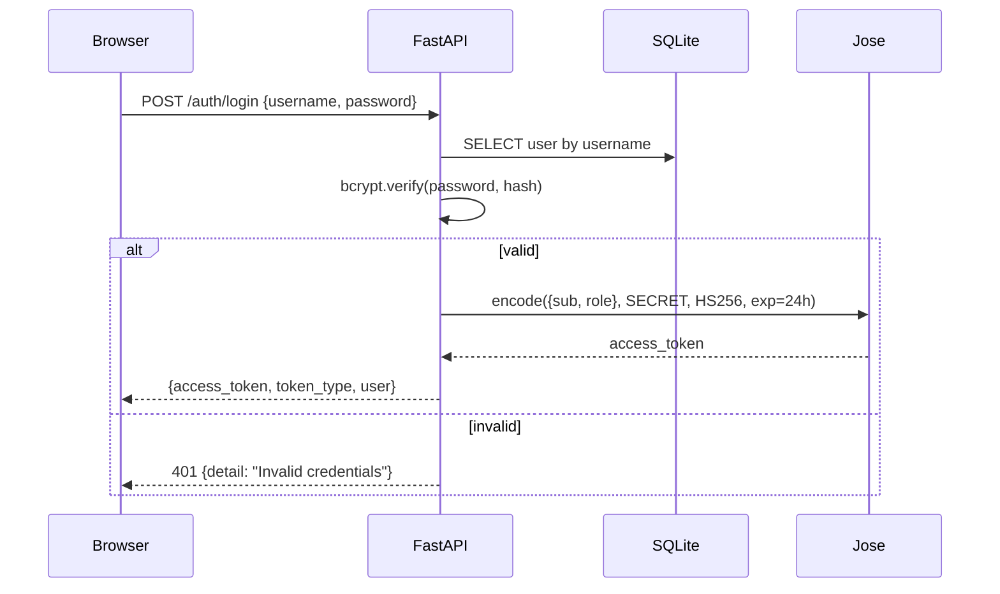

---

## 7. Frontend Architecture

### 7.1 Module Structure (pure HTML/CSS/JS — no frameworks)
```
public/app/
├── index.html              # SPA shell + <script> includes
├── css/  (5 files)         # variables, base, components, layout, views
├── js/
│   ├── utils.js            # el(), formatters, icons
│   ├── api.js              # api() helper (XTransformPort routing)
│   ├── charts.js           # canvas charts (line/bar/donut/gauge/sparkline)
│   ├── components.js       # card, statCard, toast, modal, table, dropzone
│   ├── router.js           # hash router
│   ├── app.js              # bootstrap: sidebar, topbar, theme, status bar
│   └── views/  (11 files)  # one per route
└── assets/logo.svg
```

### 7.2 Routing
- Hash-based: `#/dashboard`, `#/churn`, `#/healthcare`, `#/damage`, `#/nlp`,
  `#/rag`, `#/agent`, `#/monitoring`, `#/slm`, `#/settings`, `#/login`.
- Router calls `view.render(container)`; view returns `{ dispose() }` for cleanup.

### 7.3 State
- JWT in `localStorage['aiplatform_token']`.
- Theme in `localStorage['aiplatform_theme']`.
- No global store; each view fetches its own data via `api()`.

---

## 8. Non-Functional Requirements

| Requirement | Implementation | Target |
|---|---|---|
| **Performance** | LRU prediction cache, lazy model loading, singleton models | P50 < 50ms, P95 < 500ms |
| **Scalability** | Stateless FastAPI workers; SQLite → Postgres for scale | Horizontal scale behind LB |
| **Availability** | Health checks (`/health`), model status map | Graceful degradation per-model |
| **Security** | JWT (HS256, 24h), bcrypt password hashing, CORS, input validation (Pydantic), rate limiting, secure file-upload validation | OWASP-aligned |
| **Observability** | Structured logging, `/metrics` (latency p50/p95/p99, error rate, per-model stats, system CPU/mem/disk, 24-bucket time series) | Prometheus-ready |
| **Maintainability** | Modular routers/services/schemas, typed Pydantic, single API contract doc | < 1 day to add a new module |
| **Portability** | Docker + docker-compose (backend, LLM, nginx frontend) | One-command deploy |

### 8.1 Security Measures
- Passwords hashed with bcrypt (via passlib).
- JWT signed with HS256 + `SECRET_KEY` (env var).
- File uploads validated by content-type + size + decode attempt.
- CORS configurable (default `*` for demo; restrict in prod).
- Rate limiting middleware (in-memory token bucket per IP).
- Input sanitization via Pydantic strict validation.

### 8.2 Observability
- Every request logged with method, path, status, latency.
- `/metrics` exposes: api_usage, latency percentiles, error_rate, model_metrics,
  endpoints breakdown, system stats, 24-point time series.
- `/health` exposes: per-model load status, DB connectivity, LLM connectivity, uptime.

---

## 9. Deployment Topology

### 9.1 Sandbox (current)
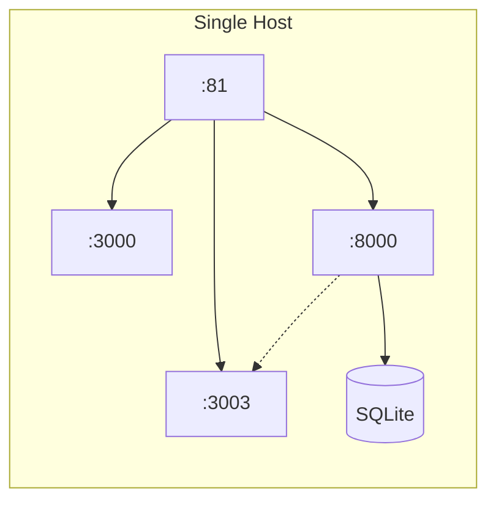

### 9.2 Production (target)
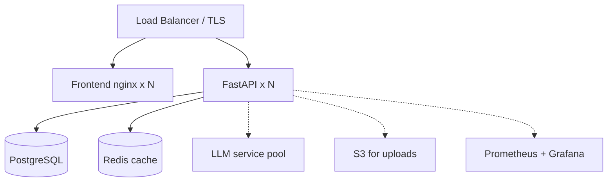

See `DEPLOYMENT.md` for the production hardening checklist and GPU model swap.

---

## 10. Design Decisions & Trade-offs

| Decision | Rationale | Trade-off |
|---|---|---|
| FastAPI (sync models) | ML libs are sync; async wrappers suffice | Not fully async I/O on inference |
| SQLite for demo | Zero-config, single-file | Swap to Postgres for multi-replica |
| In-process ML models | Lowest latency, simplest ops | One model per process; use Triton for scale |
| TF-IDF+SVD embeddings (RAG) | No torch dependency in sandbox | Swap to MiniLM for better semantic match |
| Guided ReAct (vs free LLM planner) | Guarantees all 4 tools run; deterministic | Less "agentic" than free-form planning |
| Hash-based SPA routing | No server routes needed; pure static | No SSR / deep-link without hash |
| `?XTransformPort` gateway routing | Sandbox exposes one port | Remove in prod (direct nginx proxy) |

---

## 11. Testing & Verification

| Layer | Method | Status |
|---|---|---|
| Unit | Per-service smoke tests (curl) | ✅ all endpoints verified |
| Integration | End-to-end browser verification (Agent Browser) | ✅ all 10 views, zero errors |
| Contract | API_CONTRACT.md is the source of truth | ✅ backend + frontend conform |
| Real-output | Differential input audit (different inputs → different outputs) | ✅ all 8 modules |
| Performance | `/metrics` tracks live p50/p95/p99 | ✅ |
| Visual | VLM verification of charts/gauges | ✅ |

---

## 12. Open Items / Future Work
- Swap CV/BERT/LSTM/SLM substitutes for real torch/transformers models on a GPU host (contract unchanged).
- Add Postgres + Redis for multi-replica scaling.
- Add Prometheus exporter + Grafana dashboards.
- Add CI/CD (GitHub Actions) for automated test + deploy.
- Add multi-agent orchestration (CrewAI/AutoGen) beyond the single HR agent.
